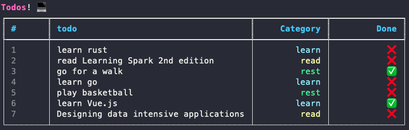
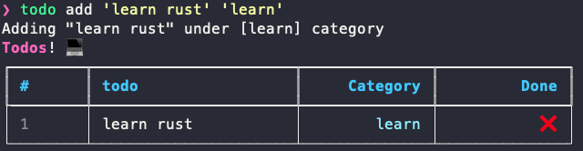
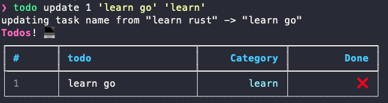
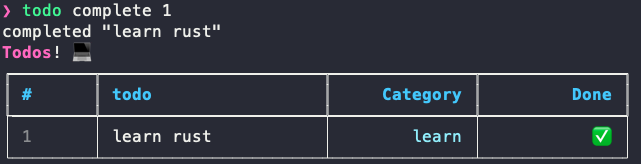
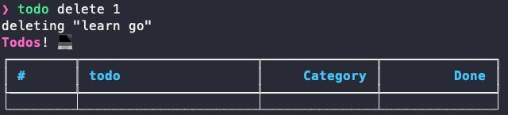

# TODO CLI in python

This is a todo app in the CLI built with Python.

## Tech Stack

- [Rich](https://github.com/Textualize/rich) - format the table and text colors.
- [Typer](https://github.com/tiangolo/typer) - CLI functionality
- sqlite3 - database for the tasks

## Demo



## Run Locally

Clone the project

```bash
  git clone https://link-to-project
```

Go to the project directory

```bash
  cd todocli
```

Install dependencies with [poetry](https://python-poetry.org/)

```bash
  poetry install
```

Run the `todocli.py` file with specific commands

```bash
  poetry run python todocli.py --commands
```

You can alias the command like below to shorten things down

```bash
  alias todo="poetry run python todocli.py"
```

## Usage/Examples

This is the list of commands available

```text
Commands:
  add          adds an item
  clear        removes all tasks
  complete     completes an item
  delete       deletes an item
  remove-done  removes all completed tasks
  show         show the todos in a table
  update       updates an item
```

### Adding a tasks



### Updating a tasks



### Completing a tasks



### Deleting a tasks



### Clear the table

```bash
todo clear
```

### Adding more category colors

The available categories with colors are in `COLORS` dictionary in `todocli.py`. To add more options, just populate the dictionary as follows

```py
{...,
"category_name": "color"
}
```

## Acknowledgements

- [Python Engineer tutorial on this TODO app](hthttps://youtu.be/ynd67UwG_cI)
- This README file was created with [readme.so](https://readme.so/)
